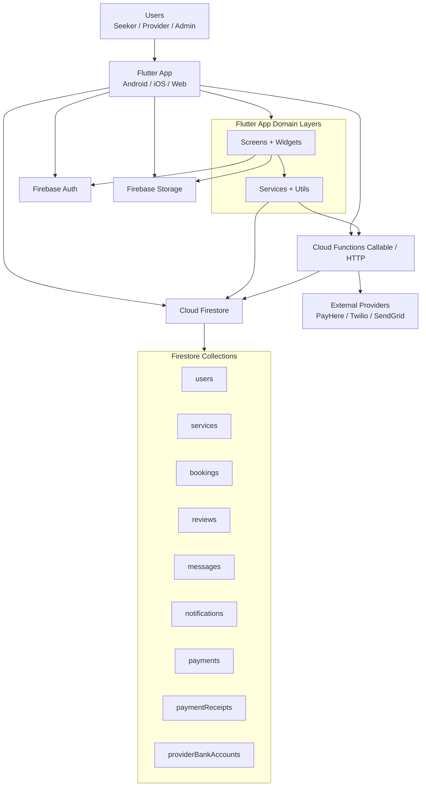

# System Architecture

## Overview

Lanka Connect uses a Flutter client (Android/iOS/Web) with Firebase-managed backend services.
Core CRUD operations run directly against Firestore, while payment and notification-sensitive
operations are delegated to Cloud Functions.

## Architecture Diagram (Current Runtime)

## Responsibility Allocation

- Client-side responsibilities:
  - Authentication and role-gated navigation.
  - Service discovery, booking lifecycle UI, chat UI, review submission UI.
  - Payment method selection and checkout/transfer submission initiation.
- Backend (Cloud Functions) responsibilities:
  - Payment session creation (`createPayHereCheckoutSession`).
  - Bank transfer intake and admin verification (`submitBankTransfer`, `verifyBankTransfer`).
  - Gateway callback verification (`payHereWebhook`).
  - Payment receipt dispatch (SMS and email) with delivery logs.
- Data layer responsibilities:
  - Firestore as source of truth for bookings, payments, and moderation data.
  - Storage for media assets.
  - Firestore rules for role-based access controls.

## Security Boundaries

- User identity is resolved by Firebase Auth token (`request.auth.uid`).
- Cloud Functions enforce server-side checks for payment ownership and status transitions.
- Admin-only operations validate role from `users/{uid}.role`.
- Webhook processing validates PayHere signature before mutating payment state.

## Payment Data Flow Summary

1. Seeker starts payment from booking (`status=accepted`).
2. Callable function creates a payment attempt and updates booking payment state.
3. User completes gateway checkout or submits transfer reference.
4. Webhook/admin verification finalizes payment state.
5. Booking is updated with paid/failed status, and receipt delivery is attempted.
